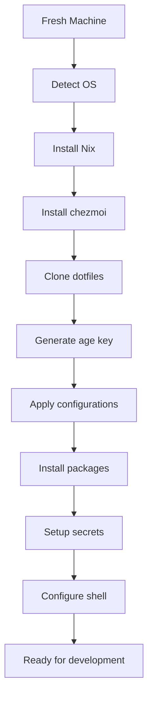

# 2. Modern Architecture

## The Complete Modern Stack

A well-designed development environment combines multiple layers that work together seamlessly. Here's how modern setups are architected:

```
┌─────────────────────────────────────────────┐
│                Applications                 │
│  VS Code • Browsers • GUI Tools            │
├─────────────────────────────────────────────┤
│             Configuration Layer             │
│  chezmoi • dotfiles • templates            │
├─────────────────────────────────────────────┤
│            Package Management               │
│  Nix • Homebrew • System Packages          │
├─────────────────────────────────────────────┤
│             Security & Secrets              │
│  SOPS • age • 1Password • direnv           │
├─────────────────────────────────────────────┤
│              Base System                    │
│  macOS • Ubuntu • WSL2                     │
└─────────────────────────────────────────────┘
```

## Core Components

### 1. Package Management Layer

**Primary: Nix Package Manager**
```nix
# nix/home.nix
{ pkgs, ... }: {
  home.packages = with pkgs; [
    # Modern CLI tools
    eza          # Better ls
    bat          # Better cat
    fd           # Better find
    ripgrep      # Better grep
    fzf          # Fuzzy finder
    
    # Development tools
    git
    nodejs
    python3
    rustc
    
    # System utilities
    htop
    tmux
    curl
    wget
  ];
}
```

**Secondary: Platform-Specific Managers**
```yaml
# .chezmoi.yaml.tmpl
{{- if eq .chezmoi.os "darwin" }}
# macOS: Homebrew for GUI apps
homebrew:
  taps:
    - homebrew/cask
  casks:
    - visual-studio-code
    - google-chrome
    - docker
    - 1password
{{- end }}
```

### 2. Configuration Management

**chezmoi as the Configuration Engine**
```bash
# Directory structure
~/.local/share/chezmoi/
├── .chezmoi.yaml.tmpl      # Main config
├── dot_gitconfig.tmpl      # Git configuration
├── dot_config/             # Application configs
│   ├── fish/
│   ├── starship.toml
│   └── code/
├── scripts/                # Setup scripts
└── private_dot_ssh/        # SSH keys (encrypted)
```

**Template-Driven Configuration**
```toml
# dot_config/starship.toml.tmpl
format = """
$username\
$hostname\
$directory\
$git_branch\
$git_state\
$git_status\
$cmd_duration\
$line_break\
$character"""

{{- if eq .chezmoi.os "darwin" }}
[character]
success_symbol = "[➜](bold green)"
{{- else }}
[character]
success_symbol = "[λ](bold green)"
{{- end }}
```

### 3. Secrets Management Architecture

**Multi-Layer Security Approach**
```
External Secrets          Local Encryption         Environment
┌─────────────────┐      ┌─────────────────┐      ┌─────────────────┐
│   1Password     │ ──── │  SOPS + age     │ ──── │     direnv      │
│   Bitwarden     │      │  Encrypted YAML │      │   .envrc files  │
│   System Keychain│      │  Git-tracked    │      │ PROJECT_API_KEY │
└─────────────────┘      └─────────────────┘      └─────────────────┘
```

**Implementation Example**
```yaml
# secrets.yaml (encrypted with SOPS)
github_token: ENC[AES256_GCM,data:Qw...==,iv:xyz,tag:abc,type:str]
openai_api_key: ENC[AES256_GCM,data:Mn...==,iv:xyz,tag:def,type:str]
```

```bash
# .envrc template
export GITHUB_TOKEN="{{ (index (sops . "secrets.yaml") "github_token") }}"
export OPENAI_API_KEY="{{ (index (sops . "secrets.yaml") "openai_api_key") }}"
```

### 4. Shell Environment

**Fish Shell with Modern Enhancements**
```fish
# dot_config/fish/config.fish.tmpl
# Environment setup
set -x EDITOR code
set -x BROWSER open

{{- if eq .chezmoi.os "darwin" }}
# macOS specific paths
fish_add_path /opt/homebrew/bin
{{- end }}

# Nix integration
if test -e ~/.nix-profile/etc/profile.d/nix.fish
    source ~/.nix-profile/etc/profile.d/nix.fish
end

# Modern CLI aliases
alias ls="eza --icons"
alias cat="bat"
alias find="fd"
alias grep="rg"

# Git aliases
alias g="git"
alias gs="git status"
alias gd="git diff"
alias ga="git add"
alias gc="git commit"
```

## Integration Patterns

### Bootstrap Process Flow



**One-Command Bootstrap**
```bash
#!/bin/bash
# install.sh - The complete bootstrap

set -e

# Detect operating system
detect_os() {
    case "$(uname -s)" in
        Darwin*)    echo "macos" ;;
        Linux*)     
            if grep -q microsoft /proc/version; then
                echo "wsl"
            else
                echo "linux"
            fi
            ;;
        *)          echo "unknown" ;;
    esac
}

OS=$(detect_os)
echo "🔍 Detected OS: $OS"

# Install Nix (multi-user installation)
if ! command -v nix &> /dev/null; then
    echo "📦 Installing Nix..."
    sh <(curl -L https://nixos.org/nix/install) --daemon
    source /nix/var/nix/profiles/default/etc/profile.d/nix-daemon.sh
fi

# Install chezmoi via Nix
echo "⚙️  Installing chezmoi..."
nix-env -iA nixpkgs.chezmoi

# Initialize dotfiles
echo "📂 Setting up dotfiles..."
chezmoi init https://github.com/yourusername/dotfiles.git

# Apply configuration
echo "🔧 Applying configuration..."
chezmoi apply

echo "✅ Bootstrap complete! Please restart your shell."
```

### Cross-Platform Compatibility

**Conditional Configuration Logic**
```yaml
# .chezmoi.yaml.tmpl
{{- $osid := .chezmoi.os -}}
{{- if eq $osid "darwin" -}}
{{-   $brew := output "brew" "--prefix" | trim -}}
{{- end -}}

data:
  os: {{ $osid }}
  {{- if eq $osid "darwin" }}
  homebrew_prefix: {{ $brew }}
  {{- end }}
  hostname: {{ .chezmoi.hostname }}
  
sourceDir: {{ .chezmoi.sourceDir }}
```

**OS-Specific Package Lists**
```nix
# nix/packages.nix
{ pkgs, system, ... }:

with pkgs; [
  # Universal packages
  git
  curl
  wget
  fzf
  ripgrep
  
] ++ lib.optionals stdenv.isDarwin [
  # macOS specific
  darwin.iproute2mac
  
] ++ lib.optionals stdenv.isLinux [
  # Linux specific  
  iproute2
  util-linux
]
```

### Application Configuration Automation

**VS Code Settings Sync**
```json
// dot_config/Code/User/settings.json.tmpl
{
  "editor.fontFamily": "{{ .font.mono }}",
  "editor.fontSize": 14,
  "terminal.integrated.shell.osx": "/usr/local/bin/fish",
  {{- if eq .chezmoi.os "linux" }}
  "terminal.integrated.shell.linux": "/usr/bin/fish",
  {{- end }}
  "workbench.colorTheme": "{{ .theme.editor }}"
}
```

**Fish Shell Functions**
```fish
# dot_config/fish/functions/dev.fish.tmpl
function dev --description "Quick project navigation"
    set project_dirs ~/Projects ~/Work {{ .dev.extra_dirs }}
    
    set selected (find $project_dirs -maxdepth 2 -type d -name ".git" \
                 | sed 's|/.git||' \
                 | fzf --preview "eza --tree --level=2 {}")
    
    if test -n "$selected"
        cd "$selected"
        {{ if .editor.auto_open }}
        code .
        {{ end }}
    end
end
```

## Maintenance & Updates

### Automated Update Workflow

**GitHub Actions for Testing**
```yaml
# .github/workflows/test-dotfiles.yml
name: Test Dotfiles
on: [push, pull_request]

jobs:
  test:
    strategy:
      matrix:
        os: [ubuntu-latest, macos-latest]
    runs-on: ${{ matrix.os }}
    
    steps:
      - uses: actions/checkout@v3
      
      - name: Install Nix
        uses: cachix/install-nix-action@v17
        
      - name: Test chezmoi apply
        run: |
          nix-env -iA nixpkgs.chezmoi
          chezmoi init --source=$PWD
          chezmoi apply --dry-run --verbose
```

**Local Update Script**
```bash
#!/bin/bash
# scripts/update.sh

echo "🔄 Updating development environment..."

# Update Nix packages
echo "📦 Updating Nix packages..."
nix-channel --update
home-manager switch

# Update chezmoi managed files
echo "⚙️  Updating configurations..."
chezmoi update

# Update platform-specific packages
case "$(uname -s)" in
    Darwin*)
        echo "🍺 Updating Homebrew..."
        brew update && brew upgrade
        ;;
    Linux*)
        echo "📱 Updating system packages..."
        sudo apt update && sudo apt upgrade
        ;;
esac

echo "✅ Update complete!"
```

## Performance Optimization

### Lazy Loading Strategies

**Fish Shell Optimization**
```fish
# dot_config/fish/config.fish.tmpl
# Lazy load expensive operations
function __init_nvm --on-variable PWD
    if test -f .nvmrc
        if not command -v nvm >/dev/null
            # Load nvm only when needed
            bass source ~/.nvm/nvm.sh
        end
        nvm use
    end
end
```

**Starship Prompt Optimization**
```toml
# dot_config/starship.toml.tmpl
command_timeout = 500  # Faster prompt rendering

[git_status]
disabled = false
conflicted = "🏳"
ahead = "🏎💨"
behind = "😰"
diverged = "😵"
untracked = "🤷‍"
stashed = "📦"
modified = "📝"
staged = "👍"
renamed = "👅"
deleted = "🗑"
```

## Benefits of This Architecture

### For Individual Developers

- ✅ **One-command setup**: New machine ready in minutes
- ✅ **Consistent environment**: Same tools everywhere
- ✅ **Easy maintenance**: Update all configs with one command
- ✅ **Secure secrets**: Encrypted credentials in Git
- ✅ **Cross-platform**: Works on macOS, Linux, WSL2

### For Teams

- ✅ **Shared configurations**: Common development environment
- ✅ **Onboarding speed**: New team members productive quickly
- ✅ **Reduced support**: Fewer "works on my machine" issues
- ✅ **Standardization**: Common tools and workflows
- ✅ **Version control**: All changes tracked and reversible

In the next chapter, we'll dive deep into the cross-platform strategy that makes this architecture work across different operating systems. 